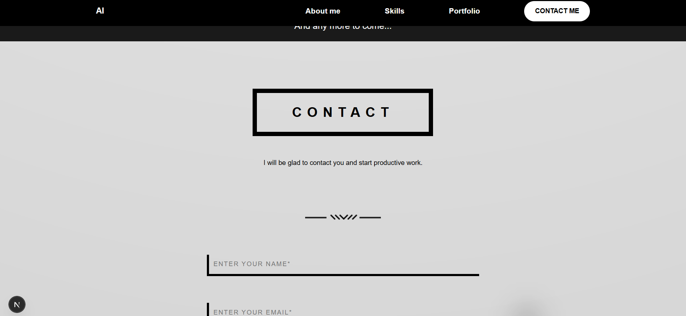

Документация для сдачи проекта

Общая структура проекта

Проект — это сайт-портфолио на Next.js (app router). Главные части:

•	layout.tsx — корневой layout (шрифт, общие теги html/body).

•	page.tsx — главная страница, рендерит компонент HomePage.

•	components — папка с переиспользуемыми UI-компонентами (Header, Footer, Cursor, Container и набор компонентов на главной странице в HomePageComponents).

•	Каждый визуальный блок имеет отдельный CSS/SCSS-модуль рядом с компонентом.

Дальше — подробный разбор файлов и их назначения.

layout.tsx

Этот файл — корневой layout приложения (Next.js app router). Что он делает:

•	Импортирует глобальные CSS через import "./globals.css". Это гарантирует, что базовые стили применяются ко всем страницам.

•	Подключает два шрифта с Google Fonts через next/font/google: Geist и Geist_Mono. Они сохраняются как CSS-переменные (--font-geist-sans, --font-geist-mono) и затем применяются к body через класс, который объединяет эти переменные. Таким образом шрифты централизованно доступны всему приложению.

•	Экспортирует metadata (title/description) — используется Next.js для метаданных страницы.

•	По сути, RootLayout оборачивает всё приложение тегами <html lang="en"><body>…</body></html>, добавляя глобальные шрифты. Никакой другой логики нет.

Зачем это нужно: централизованное подключение шрифтов, глобальных стилей и базовой HTML-оболочки. Если захотите поменять шрифты или добавить глобальные метатеги/скрипты — место для изменений.

page.tsx

Простая точка входа для главной страницы. Импортирует HomePage (компонент, который собирает все блоки на странице) и рендерит его. Тут не выполняется бизнес-логика — всё делегировано в HomePage.

Container.tsx

Небольшой вспомогательный компонент-обёртка:

•	Принимает children и необязательный className.

•	Возвращает 
 с базовым классом styles.container и добавочным className, с применением SCSS-модуля.

Зачем: централизация контейнера с фиксированными стилями (ширина контента, паддинги, выравнивание) — позволяет единообразно располагать контент по ширине страницы.

Cursor.tsx

Кастомный "shadow" курсор:

•	Hook-версия ('use client') — использует useRef, useEffect.

•	Слежение за движением мыши: mousemove обновляет позицию mouse.current.

•	Анимация через requestAnimationFrame: позиция pos плавно интерполируется к mouse (коэффициент 0.9) и применяется как transform к DOM-элементу.

•	Возвращает div с ref и классом cursorShadow.
Зачем: визуальный эффект плавного тянущегося курсора. Работает на клиенте, поэтому пометка 'use client' обязательна. Можно расширить: эффекты при наведении, взаимодействие с ссылками и т.д.

Header.tsx

Навигационная шапка с адаптивным бургер-меню:

•	'use client' — использует state и effect.

•	Состояния: scrolled (для изменения стиля при прокрутке), active (текущая секция), menuOpen (открыто/закрыто мобильное меню).

•	В useEffect добавлен обработчик скролла, который:

o	Устанавливает scrolled = window.scrollY > 600, т.е. шапка меняет стиль после прокрутки 600px.

o	Определяет какая секция сейчас видна, пробегая по id-секциям ["about","skills","portfolio","contact"]; если какая-то секция покрывает точку 150px от верхней области окна — помечает её как текущую (current = id) — это используется для подсветки пункта меню (active).

•	Есть бургер-кнопка — переключает menuOpen.

•	Навигация реализована как набор button + a href="#id" — при нажатии закрывает меню (closeMenu).

•	Используется Container для центровки контента.
Зачем: отвечает за навигацию по одностраничному сайту (scroll-to-section), визуальные изменения при прокрутке (например, фон/тень), а также за мобильный UX (бургер-меню).

Важная деталь: поиск секций по document.getElementById внутри обработчика scroll — простая и понятная реализация "скролл-спайкера", но может потребовать оптимизации (throttle/debounce) при частой прокрутке.

Footer.tsx

Нижняя часть сайта:

•	Также 'use client' — содержит функцию scrollToTop для плавного скролла наверх.

•	Внутри компонента вставлен большой фрагмент тестового/демонстрационного кода с переменными и множественными console.log, console.warn, console.table и т.д. Это, по сути, отладочный мусор или демонстрация JS-конструкций, не влияющая на UI.

•	UI: блок "BACK TO TOP", иконки социальных ссылок (facebook, linkedin, instagram, gmail), и текст с копирайтом.
Зачем: отображает контакты, соцссылки, и предоставляет кнопку прокрутки вверх. Текстовые и JS-консоли — рекомендуется удалить/очистить перед продакшеном, т.к. они засоряют консоль.
src/components/HomePageComponents/*

Папка содержит блоки, составляющие главную страницу. Коротко по каждому:

•	HomePage.tsx — собирает все секции страницы в порядке: Cursor, Header, HeroBlock, Divider, AboutMe, MainDivider, Profesion, Skills, Portfolio, Contact, Footer. Это основном контейнер для одноэкранной структуры. Он определяет id-секции (id="hero", id="about" и т.д.), которые используются Header для подсветки.

•	HeroBlock.tsx:

o	Клиентский компонент, хранит visitorName в localStorage.

o	При первом рендере читает visitorName из localStorage.

o	Кнопка Introduce yourself вызывает prompt, записывает/удаляет имя в localStorage и обновляет состояние.

o	Показывает приветствие: Hi, ${visitorName} или Hi! и имя разработчика "Alihan", его позицию "Front-end developer".

o	Содержит ссылки на почту и GitHub, а также адаптивный блок mobileBlock с пораждающимися вёрсткой отличиями.

o	Зачем: это верхний экран (hero), персональная презентация/приветствие, базовая интерактивность для вовлечения посетителя (prompt и сохранение в localStorage).

•	Divider и MainDivider / MainDividerW:

o	Эти компоненты скорее визуальные — разделители между секциями (вёрстка для линии/псевдоэлементов). MainDividerW вероятно белая версия, MainDivider — базовая. Их можно менять по дизайну.

•	AboutMe.tsx:

o	Статический блок "about me" с текстом о себе. Использует Container. Небольшой вспомогательный UI.

•	Profesion/Profesion.tsx и Skills/Skills.tsx:

o	Очевидно, содержат информацию о профессиональных навыках и опыте. В предоставленных файлах не читались их содержимое, но исходя из наименования — отвечают за список навыков и краткое описание профессии.

•	Contact/Contact.tsx:

o	В HomePage рендерится секция contact — вероятно содержит форму или контакты, чтобы связаться с автором.

•	Portfolio.tsx:

o	Клиентский компонент, использует Swiper (external lib) для карусели/слайдера.

o	Логика табов: tabs = ["All","Tournaments","Self Projects"], состояние activeTab, swiperRef.

o	Массив allImages — множество URL (частично пустой элемент), затем images распределяет их по вкладкам (слайсы).

o	handleTabChange — меняет вкладку и вызывает swiper.slideToLoop(index).

o	handleSlideChange синхронизирует активную вкладку с реальным индексом слайдера.

o	Компонент рендерит навигационные табы и слайдер. Также есть seeMoreBlock.

o	Зачем: показывает портфолио с интерактивным переключением категорий и визуальной каруселью работ.

Поведение и взаимодействия (взаимосвязь компонентов)

•	layout.tsx задаёт глобальные шрифты и подключает глобальные стили.

•	page.tsx рендерит HomePage — все секции находятся внутри одной страницы.

•	Header опирается на id-секции, которые определены в HomePage — это реализация одностраничной навигации (анкорные ссылки + подсветка).

•	Cursor добавляет визуальный эффект на весь сайт — рендерится в HomePage перед Header, поэтому виден поверх страницы (зависит от CSS z-index).

•	HeroBlock пишет/читает localStorage — персонализация приветствия.

•	Portfolio использует внешнюю библиотеку Swiper — надо убедиться, что swiper установлен в package.json, иначе сборка упадёт.

•	Footer содержит JS-выводы в консоль — это стоит убрать.

Заключение
Коротко: проект — статическое одностраничное портфолио на Next.js. Архитектура разделена по компонентам: layout.tsx — глобальная оболочка и шрифты; page.tsx — точка входа; HomePage — собирает разделы; Header — навигация; HeroBlock — приветствие с localStorage; Cursor — кастомный курсор; Portfolio — карусель работ; Footer — контакты и "back to top". Каждый компонент использует CSS-модули/SCSS для стилей и Container для центровки контента.

Снимки
         

